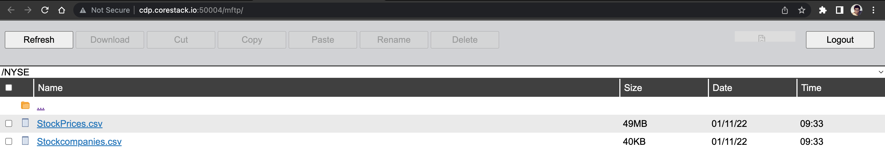
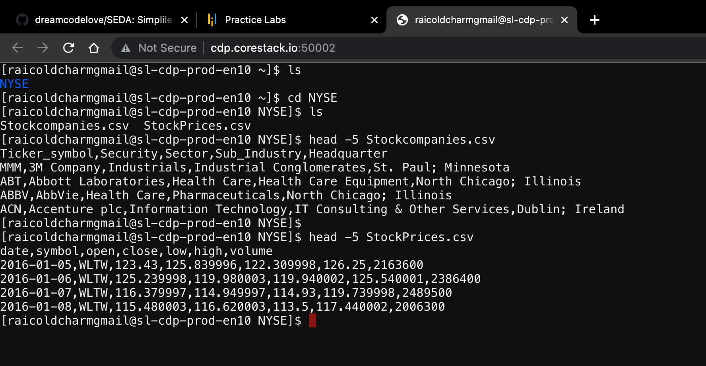
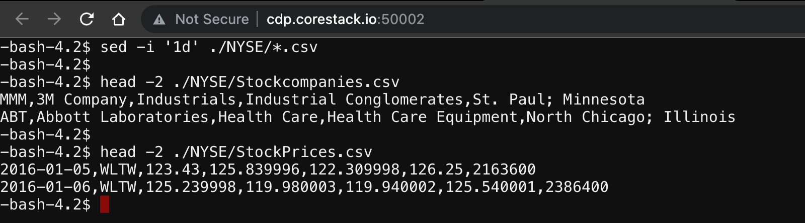

# Stock Exchange Data Analysis
Github repository for Simplilearn Assessment Project #1

## Project Description 

**Objective**

Use Hive features for data engineering or analysis and sharing the actionable insights.

**Domain**

Banking, financial services and insurance

**Analysis to be done**

Exploratory analysis to understand how MoM or YoY companies from different sectors or industries and states have progressed in a period of 7 years.

**Content**

This data set contains StockPrices.csv and Stockcompanies.csv files.

**Data dictionary**

*StockPrices.csv*
- `Date`: Trading date
- `Symbol`: Ticker code or listed company code on NY exchange
- `Open`: Intra-day opening price for each listed company
- `Close`: Intra-day closing price for each listed company
- `Low`: Intra-day lowest price for each listed company
- `High`: Intra-day highest price for each listed company
- `Volume`: Number of shares traded per day per company

*Stockcompanies.csv*
- `Ticker_Symbol`: Ticker code for each listed company
- `Security`: Legal name of the listed company
- `Sector`: Business vertical of the listed company
- `Sub_Industry`: Business domain of the listed company within a sector
- `Headquarter`: Location of company headquarter

## Analysis Tasks

### 1. Create a data pipeline using Sqoop to pull the data from the table below from MySql server to Hive.

- Database name: <username>
    - `Stock_prices`
    - `Stock_companies`

`Stock_prices` Schema

|  Column Name   | Datetype |
|----------------|----------|
| `Trading_date` | Date     |
| `Symbol`       | String   |
| `Open`         | Double   |
| `Close`        | Doble    |
| `Low`          | Double   |
| `High`         | Double   |
| `Volume`       | Integer  |

`Stock_companies` Schema

|  Column Name    | Datatype |
|-----------------|----------|
| `Ticker_symbol` | String   |
| `Company_name`  | String   |
| `Sector`        | String   |
| `Sub_industry`  | String   |
| `Headquarter`   | String   |

**Steps to load data in MySQL**

1. Use FTP module from Simplilearn lab to upload data into lab.


2. Quick view of data.


**Note**
```rgb(9, 105, 218)
Both CSV files include header which is misinterpreted as record when importing to MySQL.
```

3. Delete top line from both CSV files
.
