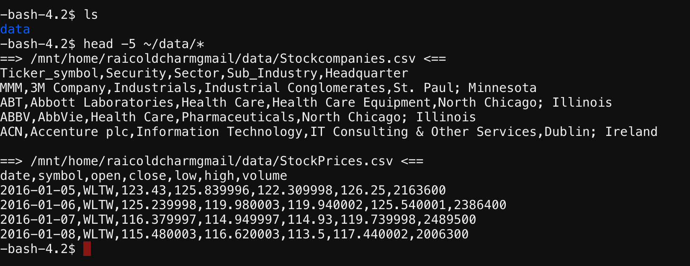

# Stock Exchange Data Analysis

Github repository for Simplilearn Assessment Project #1 by Ashish Rai

## Project Description 

**Objective**: Use Hive features for data engineering or analysis and sharing the actionable insights.

**Domain**: Banking, financial services and insurance

**Analysis to be done**: Exploratory analysis to understand how MoM or YoY companies from different sectors or industries and states have progressed in a period of 7 years.

**Content**: This data set contains `StockPrices.csv` and `Stockcompanies.csv` files.

**Data dictionary**:

- `StockPrices.csv`

| **Column Name** | **Description**                                   |
|-----------------|---------------------------------------------------|
| Date            | Trading date                                      |
| Symbol          | Ticker code or listed company code on NY exchange |
| Open            | Intra-day opening price for each listed company   |
| Close           | Intra-day closing price for each listed company   |
| Low             | Intra-day lowest price for each listed company    |
| High            | Intra-day highest price for each listed company   |
| Volume          | Number of shares traded per day per company       |

- `Stockcompanies.csv`

| **Column Name** | **Description**                                       |
|-----------------|-------------------------------------------------------|
| `Ticker_Symbol` | Ticker code for each listed company                   |
| `Security`      | Legal name of the listed company                      |
| `Sector`        | Business vertical of the listed company               |
| `Sub_Industry`  | Business domain of the listed company within a sector |
| `Headquarter`   | Location of company headquarter                       |

## Getting started

**Load data in MySQL table**

- Download all the required file(s) from link provided at bottom of simplilearn assessment page.

- Extract the compressed files and use simplilearn lab's FTP module to upload extracted files into lab. The first lines in each files is a header which need to be removed.
```shell
head -5 ~/data/*
```

```shell
sed -i '1d' *
```

- Load data files into seperate directories in HDFS.

- Start MySQL to load data in their respective tables. Since lab does not provide permission to create new MySQL databases. We will use existing database and create two new tables.
```shell
mysql -h database.bdh.com -u raicoldcharmgmail -p
```
```mysql
SHOW DATABASES;
```
```mysql
USE raicoldcharmgmail;
```
```mysql 
CREATE TABLE stock_companies (
    date DATE,
    symbol VARCHAR(10),
    open DOUBLE,
    close DOUBLE,
    low DOUBLE,
    high DOUBLE,
    volume DOUBLE );
```
```mysql
CREATE TABLE stock_prices(
    ticker_symbol VARCHAR(10),
    security VARCHAR(80),
    sector VARCHAR(80),
    sub_industry VARCHAR(80),
    headquarter VARCHAR(80) );
```

- Use Sqoop to export data from HDFS to MySQL database.

## Analysis Tasks

1. **Create a data pipeline using Sqoop to pull the data from the table below from MySql server to Hive.**

- Database name: <username>
    - `Stock_prices`
    - `Stock_companies`

### Schemas

- `stock_prices`

|  Column Name   | Datetype |
|----------------|----------|
| `Trading_date` | Date     |
| `Symbol`       | String   |
| `Open`         | Double   |
| `Close`        | Doble    |
| `Low`          | Double   |
| `High`         | Double   |
| `Volume`       | Integer  |

- `stock_companies`

|  Column Name    | Datatype |
|-----------------|----------|
| `Ticker_symbol` | String   |
| `Company_name`  | String   |
| `Sector`        | String   |
| `Sub_industry`  | String   |
| `Headquarter`   | String   |

